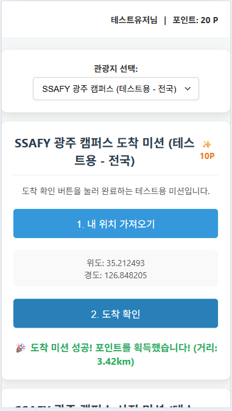
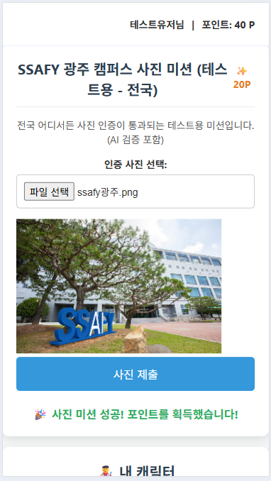

# TripQuest 🗺️

**TripQuest**는 **참여형 여행 애플리케이션**으로, 사용자가 관광지를 방문하여 위치 기반 및 사진 인증 미션을 수행하고 보상을 획득하며 여행의 재미를 더하도록 설계되었습니다.

---

## ✨ 주요 기능

-   **위치 기반 도착 미션:** GPS를 활용하여 관광지 도착을 인증.
-   **사진 인증 미션:** 사진의 위치 정보 또는 현재 위치 및 AI 분석(Gemini Vision API)을 통해 미션 수행.
-   **캐릭터 커스터마이징:** 미션 보상으로 획득한 아이템으로 캐릭터 꾸미기.
-   **포인트 시스템:** 미션 완료 시 포인트 획득 및 관리.

---

## 🛠️ 기술 스택

-   **Backend:**
  - Spring Boot 3.x
  - Java 17
  - Spring MVC
-   **Database:**
  - MySQL
  - MyBatis
-   **APIs & Libraries:**
  - Google Gemini Vision API (for AI photo verification)
  - `com.drewnoakes/metadata-extractor` (for EXIF data reading)
  - Lombok
-   **Build Tool:**
  - Maven

---

## 🖼️ 주요 화면 및 흐름

### 1. 도착 미션 수행

### 2. 사진 미션 수행

### 3. 캐릭터 커스터마이징

