

# MyTripQuest

여행을 퀘스트처럼, 당신만의 특별한 여행을 기록하고 공유하세요.

---

## 📝 작품 소개

**MyTripQuest**는 여행의 모든 순간을 퀘스트로 만들어 새로운 재미를 더하는 참여형 소셜 여행 애플리케이션입니다.
사용자는 전국의 관광지를 방문하여 위치 기반 미션과 AI 사진 인증 미션을 수행하고, 보상으로 얻은 아이템으로 자신만의 아바타를 꾸밀 수 있습니다. 퀘스트를 통해 여행을 기록하고, 랭킹 시스템으로 다른 사용자들과 선의의 경쟁을 즐겨보세요.

---

## 🌁 프로젝트 배경

많은 사람이 여행을 떠나지만, 유명한 몇몇 장소를 스치듯 방문하고 맛집을 찾아다니는 단편적인 소비로 끝나는 경우가 많습니다. 여행지의 숨겨진 이야기나 진정한 매력을 발견하는 경험은 부족합니다.

기존 여행 앱들은 주로 정보를 제공하거나 동선을 추천하는 데 그쳐, 사용자의 능동적인 참여를 유도하고 여행 자체를 콘텐츠로 만드는 데에는 한계가 있었습니다.

따라서 이 문제를 해결하기 위해 **게이미피케이션(Gamification)** 요소를 도입하여, 사용자가 퀘스트를 수행하듯 여행지를 탐험하고 능동적으로 여행에 몰입할 수 있는 새로운 웹 서비스를 제공하고자 합니다. 이를 통해 잘 알려지지 않은 관광 명소를 발굴하고, 여행객들에게 성취감과 새로운 동기를 부여하여 더욱 깊이 있는 여행 문화를 만들 수 있을 것입니다.

---

## 🎞 Demo

My Trip Quest 시연 영상 보기 (링크를 추가해주세요)

---

## ⭐ 주요 기능

-   **메인 페이지**
    지도 기반의 퀘스트 현황, 내 캐릭터 정보, 활동 로그 등을 확인할 수 있습니다.

    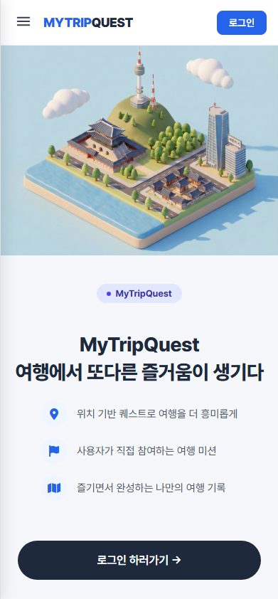
    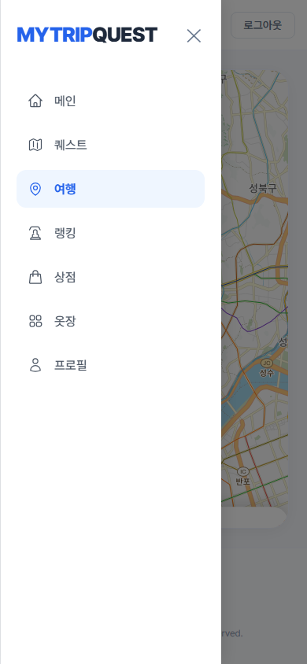

-   **퀘스트맵**
    지도 위에 표시된 다양한 퀘스트를 확인하고 수락할 수 있습니다.

    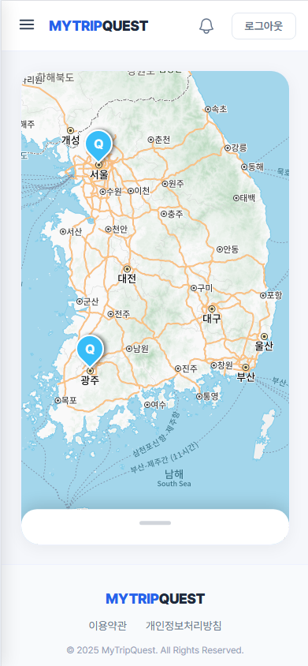
    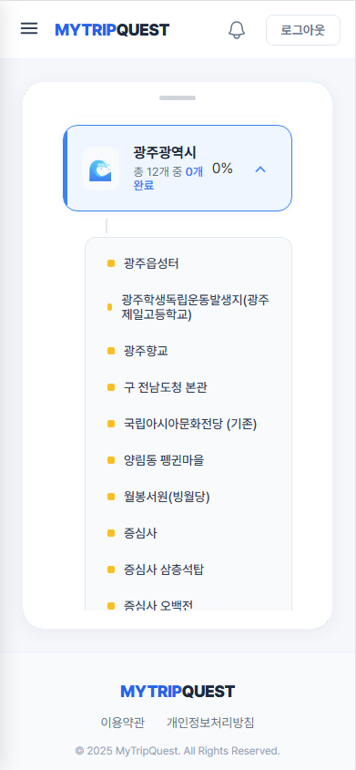

-   **퀘스트 수행**
    -   **도착 퀘스트**: GPS를 이용해 지정된 장소에 도착하면 완료됩니다.

        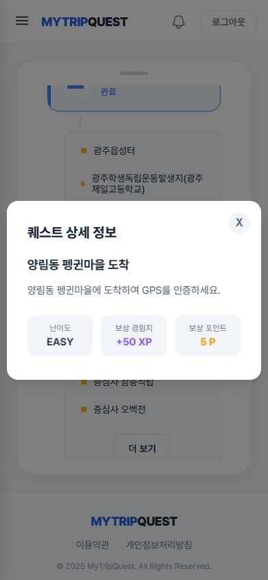

    -   **사진 퀘스트**: 특정 장소에서 AI(Google Gemini Vision API)를 통한 사진 인증으로 퀘스트를 완료합니다.

        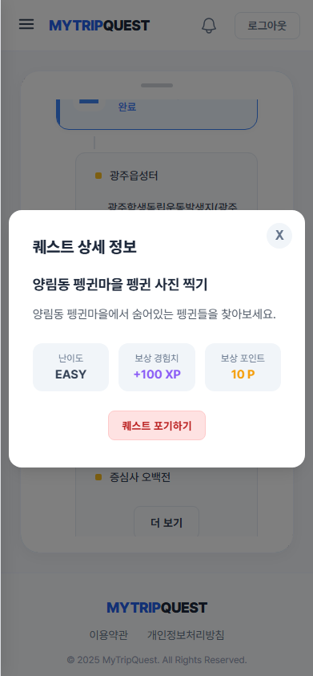

-   **여행**
    지도 위에 표시된 다양한 퀘스트를 확인하고 수락할 수 있습니다.

    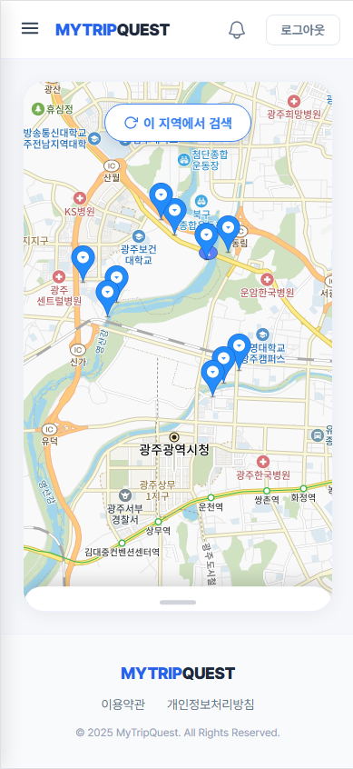
    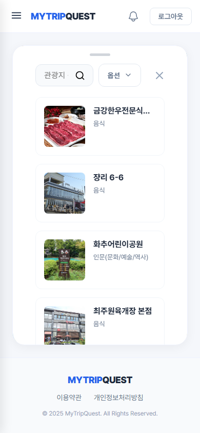

-   **피팅룸 (캐릭터 커스터마이징)**
    퀘스트 보상으로 획득한 아이템으로 아바타를 꾸밀 수 있습니다.

    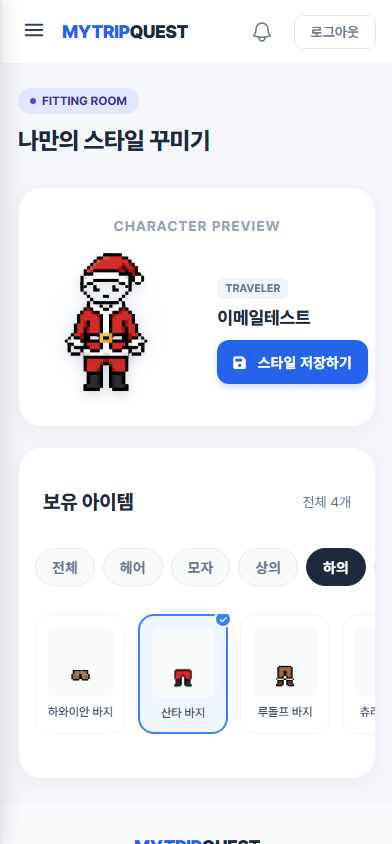

-   **상점**
    포인트를 사용하여 아바타가 착용할 수 있는 다양한 아이템을 구매할 수 있습니다.

    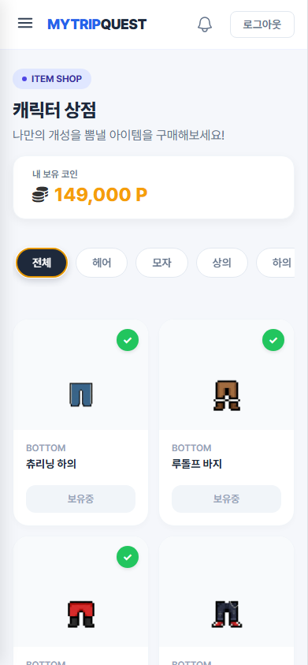

-   **랭킹**
    다른 사용자들의 랭킹을 확인하며 선의의 경쟁을 즐길 수 있습니다.

    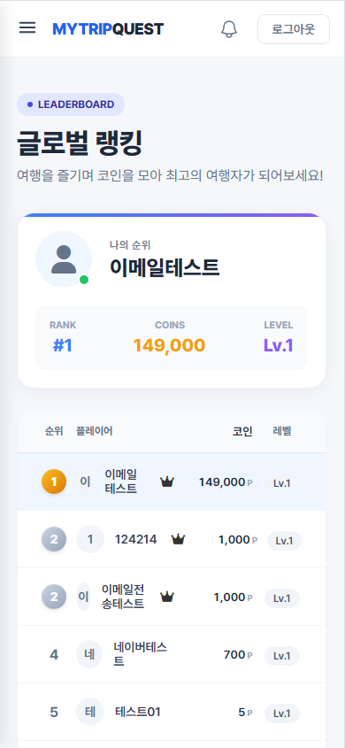

-   **마이페이지**
    내 정보, 진행 중인 퀘스트, 완료한 퀘스트 목록 등을 관리할 수 있습니다.

    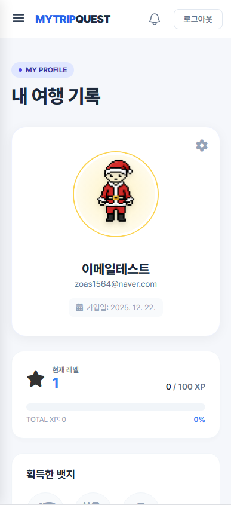
    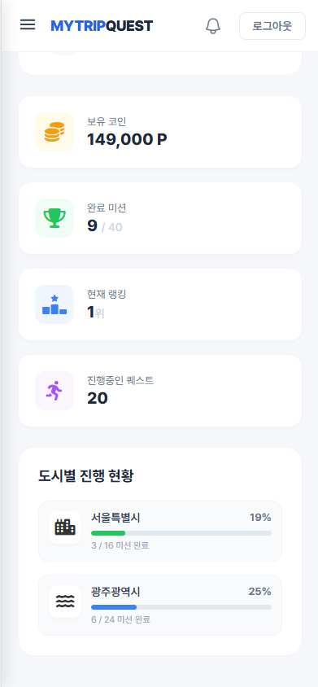

---

## 🔨 프로젝트 구조

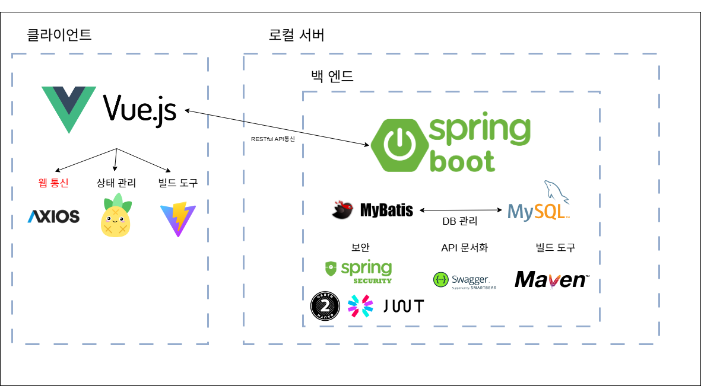

---

## 🔧 Stack

### Frontend

-   **Language**: JavaScript
-   **Library & Framework**: Vue.js 3, Vue Router, Pinia
-   **HTTP Client**: Axios
-   **Build Tool**: Vite

### Backend

-   **Language**: Java 17
-   **Framework**: Spring Boot 3.5.8
-   **Database**: MySQL
-   **ORM**: Spring Data JPA, MyBatis
-   **Security**: Spring Security, OAuth 2.0, JWT
-   **API Documentation**: SpringDoc (Swagger UI)
-   **Build Tool**: Maven

### Deploy

-   (배포 환경에 대한 정보를 기입해주세요. 예: AWS EC2, S3, RDS)

---

## 💡 기대 효과

-   **새로운 기술 학습**: Vue.js와 Spring Boot를 사용한 풀스택 웹 애플리케이션 개발 경험을 쌓을 수 있습니다.
-   **API 연동 능력**: 외부 AI API(Google Gemini)와 GPS 등 다양한 기술을 연동하고 활용하는 방법을 학습합니다.
-   **인증/인가 구현**: JWT와 OAuth 2.0을 이용한 토큰 기반 인증 시스템을 직접 설계하고 구현하며 보안에 대한 이해를 높일 수 있습니다.
-   **데이터베이스 설계**: JPA와 MyBatis를 함께 사용하며 복잡한 서비스의 데이터 모델을 설계하고 최적화하는 경험을 할 수 있습니다.

---

## 👍 활용 분야

-   **지역 관광 활성화**: 지자체와 협력하여 지역의 숨은 명소를 퀘스트로 소개해 관광객 유입을 유도할 수 있습니다.
-   **교육적 활용**: 역사적 장소나 박물관 등에서 현장 학습용 퀘스트를 제공하여 교육적 효과를 높일 수 있습니다.
-   **기업 마케팅**: 특정 브랜드나 장소와 연계한 프로모션 이벤트를 퀘스트 형식으로 진행하여 고객 참여를 유도할 수 있습니다.

---

## 🙋‍♂️ Developer

| Frontend / Backend | Frontend / Backend |
| :--------------------------------: | :--------------------------------: |
| [정관우](https://github.com/JeongGwanWoo) | [차지훈](https://github.com/hanjihun33) |